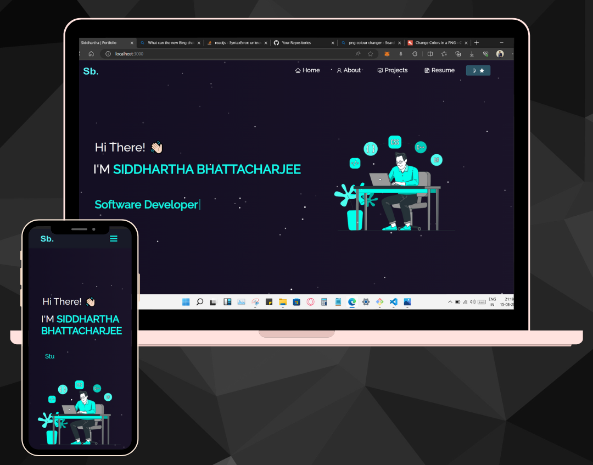
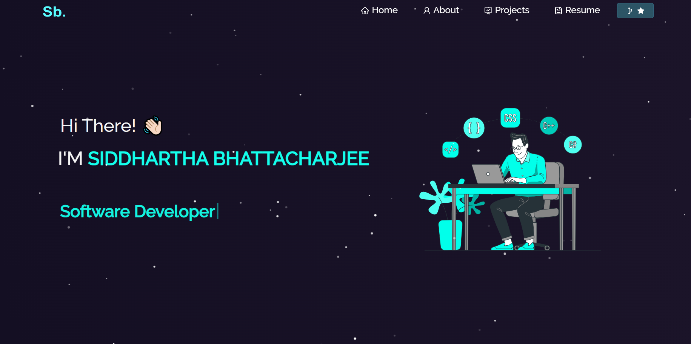

  

<h1 align="center" >My Portfolio : A small me space in this large web</h1>

  
  
  
  

Are you looking for a talented and passionate developer who can create amazing web applications and solve complex problems? If yes, then you should check out my portfolio website, where I showcase my skills, projects, and achievements.

My portfolio website has four main pages: home, about me, resume, and projects. On the home page, you can find a brief introduction of myself, as well as links to my social contacts, coding activity, and coding skills. You can also see some of the testimonials from my previous clients and employers.

On the about me page, you can learn more about my background, education, interests, and hobbies. You can also read my blog posts, where I share my insights and opinions on various topics related to web development and technology.

On the resume page, you can download a PDF version of my resume, which contains detailed information about my work experience, education, certifications, awards, and publications. You can also view my online profiles on platforms such as GitHub, LinkedIn, Stack Overflow, and HackerRank.

On the projects page, you can see some of the web applications that I have developed or contributed to. You can also find the links to the live demos, source codes, and documentation of each project. 

 

 

<a href="https://siddhartha-portfolio.vercel.app/">Deployed Website Frontend</a>    

## ©️ License
This website is licensed under the MPL-2.0 License. See <a href="LICENSE.txt">LICENSE</a> for details.

## 📞 Contact Me
If you have any questions or feedback about the Website, please don't hesitate to contact Me - 
 
<a href="https://linktr.ee/SiddharthaBhattacharjee"> Siddhartha Bhattacharjee </a>  

